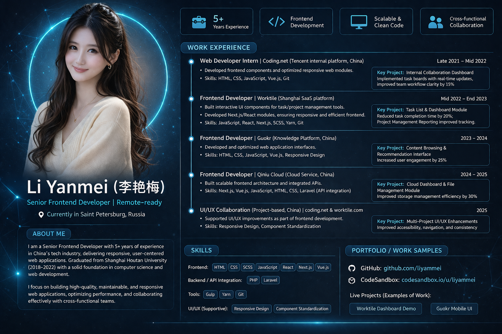

  

  

---

# 👩‍💻 About Me

**Senior Frontend Developer** focused on building **scalable, responsive web applications** and **modern APIs**.  
Passionate about **user-centered design** and **maintainable, high-performance code**.

---

# 🧠 Tech Stack

  <!-- Frontend -->
  <strong>Frontend:</strong> 
  

  <!-- Backend / API -->
  <strong>Backend / API:</strong> 
  

  <!-- Tools / DevOps -->
  <strong>Tools & DevOps:</strong> 
  

